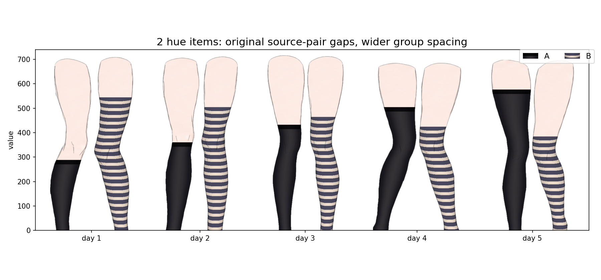

# ZettaiPlot

**\[[English](README.md)] [简体中文]**

又名“丝袜绘图”，一个 Python 数据可视化库，将数值编码为风格化动漫美学腿部素材上的袜子覆盖高度——一种「袜子拉多高」承载数据的柱状图。

> **绝对领域**（絶対領域, *zettai ryōiki*）：过膝袜与裙摆之间的裸露皮肤区域——这种图表类型正是将该视觉空间数据化。



## 特性

- **8 种程序化纹理类型** — 不透明、薄纱、渐变薄纱、水平条纹、罗纹针织、渔网、波点、蕾丝花边
- **分组/色相布局** — 每个类别支持多个系列，可配置间距或重叠
- **Matplotlib 原生集成** — 可嵌入任意现有 Matplotlib 图形；返回图元和布局元数据
- **灵活的数据输入** — 支持普通列表、NumPy 数组、二维矩阵或标签→系列映射
- **纹理图例** — 自动生成带有程序化渲染预览的色板图例
- **圆柱变形** — 纹理向腿部边缘弯曲压缩，呈现逼真立体效果

## 安装

```bash
pip install zettaiplot
```

**依赖要求：** Python ≥ 3.12 · matplotlib ≥ 3.8 · numpy ≥ 1.26 · Pillow ≥ 11.0

## 快速开始

```python
import matplotlib.pyplot as plt
import zettaiplot as zp

# 单系列
zp.sockbar(
    [42, 78, 55, 91, 33],
    label=["周一", "周二", "周三", "周四", "周五"],
    texture=zp.SheerSpec(color="black", denier=30),
)
plt.tight_layout()
plt.show()
```

```python
import matplotlib.pyplot as plt
import zettaiplot as zp

# 分组/色相图表
zp.sockbar(
    {"A班": [80, 120, 95], "B班": [60, 140, 110]},
    label=["第1周", "第2周", "第3周"],
    hue_textures={
        "A班": zp.OpaqueSpec(color="black"),
        "B班": zp.HorizontalStripesSpec(palette=zp.PaletteSpec(preset="school")),
    },
)
plt.tight_layout()
plt.show()
```

## 纹理类型

| 规格类 | 外观 |
|---|---|
| `OpaqueSpec` | 不透明过膝袜，带袜口束带 |
| `SheerSpec` | 半透明丝袜（由旦尼尔数控制） |
| `GradientSheerSpec` | 垂直不透明度渐变的薄纱 |
| `HorizontalStripesSpec` | 带圆柱变形的双色水平条纹 |
| `RibbedSpec` | 垂直罗纹针织，带高光/阴影 |
| `FishnetSpec` | 菱形网格丝袜 |
| `PolkaDotSpec` | 双色波点（交错或对齐） |
| `LaceTopSpec` | 薄纱或不透明底布，带装饰性蕾丝袜口 |

所有纹理均接受 `ColorLike` 颜色参数——可以是预设字符串（`"black"`、`"white"`、`"pink"`、`"navy"`、`"brown"`）或原始 `(r, g, b)` 元组。

## API 概览

```python
import zettaiplot as zp

# 主绘图函数
container = zp.sockbar(data, label=None, *, texture=None, hue_textures=None,
                       ax=None, legend=True, legend_kwargs=None,
                       hue_inner_gap="auto", group_gap=80,
                       odd_single="center", seed=None)

# 底层：将纹理渲染到腿部图像上
textured_img = zp.render_sock_texture(leg_image, spec, coverage_ratio=0.72)

# 底层：在坐标轴上绘制一条腿
artist = zp.draw_sock_leg(ax, leg, x=200, value=0.65, texture=spec)

# 素材库
library = zp.load_default_assets()   # 13 对 / 26 条腿
leg_img = zp.open_leg(library.assets["pair_01_l"])
```

完整 API 参考：[docs/api.zh-CN.md](docs/api.zh-CN.md)

## `sockbar()` 参数

| 参数 | 默认值 | 说明 |
|-----------|---------|-------------|
| `data` | — | 列表、数组、二维矩阵或 `{色相: 系列}` 映射 |
| `label` | 自动编号 | 类别轴标签 |
| `texture` | `OpaqueSpec()` | 非色相图表的共享纹理 |
| `hue_textures` | 自动 | 每色相的纹理映射或序列 |
| `ax` | 新建图形 | 现有 Matplotlib 坐标轴 |
| `legend` | `True` | 添加纹理色板图例（色相图表） |
| `legend_kwargs` | `{}` | 透传至 `ax.legend()` |
| `hue_inner_gap` | `"auto"` | 色相腿部间像素间距；负值表示重叠 |
| `group_gap` | `80` | 类别组间像素间距 |
| `odd_single` | `"center"` | 奇数类别时单腿位置 |
| `seed` | `None` | 腿部素材选择的随机种子 |

## 开发

```bash
# 安装开发依赖
uv sync --group dev

# 运行测试
uv run pytest

# 类型检查
uv run pyright

# 代码检查 / 格式化
uv run ruff check src tests
uv run ruff format src tests
```

## 项目结构

```
src/zettaiplot/
├── __init__.py        # 公开导出
├── bar.py             # sockbar() 顶层 API
├── data.py            # 输入规范化
├── layout.py          # 腿部放置计算
├── artists.py         # draw_sock_leg()
├── assets.py          # 打包的腿部 PNG 素材库
├── legend.py          # 纹理色板图例
└── textures/          # 程序化纹理引擎
    ├── specs.py       # 纹理规格数据类
    ├── renderers.py   # 每种类型的渲染函数
    ├── colors.py      # 颜色与调色板解析
    ├── geometry.py    # 圆柱几何辅助工具
    ├── masks.py       # Alpha 遮罩生成
    ├── blend.py       # 像素混合操作
    └── presets.py     # 便捷构造器
```

## 贡献

欢迎贡献。提交大型更改前请先开 issue 讨论方案。

1. Fork 仓库
2. 创建功能分支（`git checkout -b feat/my-feature`）
3. 提交带有测试和类型注解的更改
4. 确保 `pytest`、`pyright` 和 `ruff check` 全部通过
5. 提交 Pull Request

代码风格：使用 [Ruff](https://docs.astral.sh/ruff/) 进行格式化和代码检查，严格类型注解（Python 3.12+、PEP 695 泛型），Google 风格文档字符串。

## 许可证

MIT 许可证 — 详见 [LICENSE](LICENSE)。
