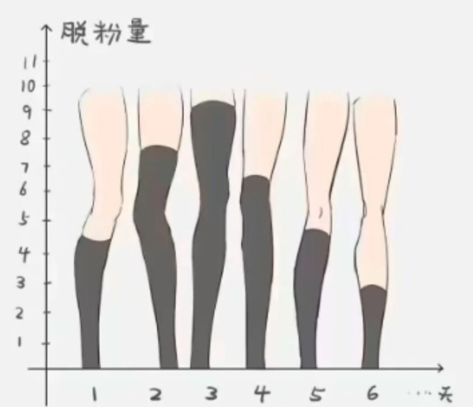

<!-- 开发过程存档，非README -->

## 📌 项目背景与愿景

本项目旨在开发一个高度契合二次元社区文化的 Python 数据可视化库。该库的核心概念是将传统的条形图（Bar Chart）与“**绝对领域**”（过膝袜与短裙之间的裸露大腿区域）相结合：

* **数据映射逻辑**：条形图的数值高度（Y轴）不通过传统的矩形色块表示，而是通过**过膝袜的覆盖高度**来呈现。
* **核心视觉底线**：大腿的总高度（即裸腿资产）在图表中保持固定且整齐划一，仅通过动态改变“穿袜子”的视觉比例来传递数据变化。

---

## 🎯 核心开发目标

打造一个高度自动化、参数化、且具备**真实立体感（Volume）**和**抗失真性**的动态绘图框架，作为后续使用 Codex 等工具进行代码施工的最高指导原则。

---

## 样品示例（灵感来源）



## 📋 需求与纹理处理方案总结

### 1. 基础“工具腿”资产需求

* **规范统一**：所有输入的裸腿素材必须在像素高度上完全一致，且统一从脚踝处切断（不含脚和鞋，不含上半身）。
* **风格留白**：素材本身需包含高质量的二次元平涂光影（高光与暗侧阴影），用于为后续的纹理提供光影底衬。
* **当前素材管线**：原始素材放置于项目根目录 `assets/`，使用 Pillow 临时脚本进行透明通道连通块切分，输出到 `assets/split/`；正式库默认运行时素材打包在 `src/zettaiplot/assets/split/`，通过 `importlib.resources` 加载。
* **切分策略**：单腿资产保持 720px 高度，横向采用非透明像素紧裁，不提前填充统一宽度；左右腿命名中的 `l/r` 表示图像内左/右位置。
* **资源清单策略**：`manifest.json` 仅保留资产 id、来源 bbox、来源 pair 关系、原始 gap 与诊断统计；图像宽高、baseline、中心锚点等可由 PNG 本身直接计算，不做冗余存储。
* **当前宽度统计**：已切分出 13 对 / 26 条腿。单腿宽度范围为 145-183px，均值约 163.73px；原始 pair 宽度范围为 303-362px，均值约 334.77px。残余背景像素团最大面积为 138px，远小于正常腿部主体。
* **预览策略**：`scripts/preview_leg_spacing.py` 继续作为间距检查产物；`scripts/preview_sock_textures.py` 生成纹理 sweep；`scripts/preview_grouped_sockbar.py` 现在直接调用正式 `zp.sockbar`，用于验证 grouped/hue 间距、负间距重叠和图例 swatch。

### 1.1 紧裁资产的渲染锚点约定

紧裁后的 PNG 不存储额外锚点。绘图时通过图像尺寸即时计算：

* `baseline_y = image.height - 1`
* `layout_anchor_x = (image.width - 1) / 2`
* `draw_x = category_center_x - layout_anchor_x`
* `draw_y = chart_baseline_y - baseline_y`

数据类别与腿的关系暂定为 **一类 = 一条腿**。当类别数为奇数且需要视觉配对时，对外接口应提供 `odd_single` 参数，可选值为 `left`、`center`、`right`，默认 `center`。其中 `left` 表示第 0 个类别单独居中，`center` 表示第 `n // 2` 个类别单独居中，`right` 表示第 `n - 1` 个类别单独居中；其余类别按数据顺序两两配对，pair 内第一类使用 `l` 资产，第二类使用 `r` 资产。

### 2. 袜子纹理处理方案（核心算法需求）

> 材质的具体设定还需放到已有的腿部素材上看看效果是否匹配（目前的腿部素材是简易手绘风，立体感不强，无复杂阴影）。
> 因此可能不需要复杂的立体和渐变设计反而可能呈现更好的效果？可以具体实践一下看看。

纹理处理不采用静态死贴图，而是采用**动态过程生成（Procedural Generation）**。当前 v1 已拆分为 `src/zettaiplot/textures/` 包，统一低层入口为 `render_sock_texture(leg, spec, coverage_ratio=0.72)`。渲染始终基于腿部 PNG 的 alpha 通道生成袜子区域 mask，不改变原图透明区域。

当前 v1 纹理类别：

* **`opaque`**：纯色过膝袜，参数包括 `color`、`opacity`、`edge_shadow`、`cuff_height`。
* **`sheer`**：半透明丝袜/裤袜，参数包括 `color`、`denier`、`edge_enrichment`、`grain_strength`。
* **`gradient_sheer`**：带纵向透明度渐变的丝袜，参数包括 `color`、`top_opacity`、`bottom_opacity`、`gradient_curve`。
* **`horizontal_stripes`**：横条纹袜，参数包括 `palette`、`stripe_height`、`gap_height`、`warp_strength`。`palette` 支持预设与自定义双色 `PaletteSpec(color_a=..., color_b=...)`。
* **`ribbed`**：竖向罗纹针织袜，参数包括 `color`、`rib_spacing`、`rib_depth`、`highlight_strength`。
* **`fishnet`**：菱形网袜，参数包括 `color`、`cell_size`、`line_width`、`angle`。
* **`polka_dot`**：圆点/小图案袜，参数包括 `palette`、`dot_radius`、`dot_spacing`、`staggered`。`palette` 同样采用双色语义。
* **`lace_top`**：带蕾丝袜口的袜子，参数包括 `base_style`、`lace_height`、`motif_scale`、`lace_opacity`。
* **颜色策略**：`ColorLike = ColorPreset | RGB`。当前颜色预设包括 `black`、`white`、`pink`、`navy`、`brown`，也支持自定义 `(r, g, b)`；通道会被裁剪到 `0-255`。

关键图形学规则：

* **图层融合**：深色与图案类材质优先使用近似正片叠底的 tint 方式，保留裸腿素材原有线条与明暗。
* **立体边缘富集**：根据每一行腿部 alpha span 计算横向归一化坐标 `u = (x - center_x(y)) / half_width(y)`，当 `abs(u)` 接近 1 时提高边缘的透明度、暗度或图案密度。
* **圆柱体表面扭曲（Warping）**：**拒绝死板平贴**。算法需实现 2D 图形向圆柱体表面的空间映射：
1. *边缘压缩*：纹理靠近腿侧边缘时，横向视觉宽度需等比变窄。
2. *弧度下垂*：横向纹理需呈现向下的椭圆弧度，以体现大腿的饱满肉感。

### 2.1 纹理阶段性预览

使用 `scripts/preview_sock_textures.py` 生成纹理预览，输出到 `assets/split/texture_previews/`。默认使用 `pair_id=10` 作为代表性双腿，并固定 `coverage_ratio=0.72`。每种纹理类别单独生成一张预览图；枚举参数逐项展示，数值参数等距取 5 个样本展示，并且每次只 sweep 一个参数，其余参数保持默认值。

### 3. 图表布局与抗变形需求

* **长宽比锁死**：无论图表数据量多大、用户如何调整视窗，应尽可能**避免对腿部资产进行大幅度拉伸或挤压**。
* **动态画布策略**：
* *横向延展*：根据数据量自动计算并横向延展画布宽度，保持每条腿的物理长宽比恒定。
* *层级重叠*：在固定宽度画布内，当数据过于密集时，通过缩短 X 轴中心距让各条腿自然产生视觉重叠（利用 z-order 确保后排挡前排的效果自然）。

### 4. 正式库结构与公共 API

当前正式后端为 Matplotlib，包名为 `zettaiplot`，Python 版本要求为 `>=3.12`。运行依赖包括 `pillow`、`numpy`、`matplotlib`；开发依赖包括 `ruff`、`pytest`、`pyright`。核心目录如下：

* `src/zettaiplot/assets.py`：打包资产 manifest、腿部 PNG 的加载。
* `src/zettaiplot/textures/`：纹理 spec、颜色、mask、几何、blend、renderer 与 preset。
* `src/zettaiplot/data.py`：list / NumPy / mapping / DataFrame-like 输入归一化。
* `src/zettaiplot/layout.py`：类别、hue、奇数单腿、组间距与重叠布局。
* `src/zettaiplot/artists.py`：`draw_sock_leg(...)` 中层绘制接口。
* `src/zettaiplot/legend.py`：纹理矩形 swatch legend。
* `src/zettaiplot/bar.py`：顶层 `sockbar(...)` API。

顶层 API：

```python
import zettaiplot as zp

container = zp.sockbar(
    x=None,
    height=None,
    *,
    data=None,
    hue=None,
    texture=None,
    hue_textures=None,
    ax=None,
    legend=True,
    legend_kwargs=None,
    hue_inner_gap=14,
    group_gap=80,
    odd_single="center",
    seed=None,
)
```

行为约定：

* `x`、`height`、`hue` 可以是数组式输入，也可以是 `data` 中的列名；`data` 通过 duck typing 支持 mapping / DataFrame-like 对象，不强制依赖 pandas。
* `ax=None` 时自动创建 Matplotlib figure/axes；传入已有 `ax` 时直接绘制到该 axes。
* 数值映射为袜子覆盖比例：当前 v1 使用正值最大值归一化到 `[0, 1]`，腿部总高度始终保持视觉固定。
* 返回 `SockBarContainer`，包含 `ax`、`image_artists`、`asset_ids`、原始值、归一化值、legend handles/labels、布局 placements 与实际 legend 列数。
* 中低层接口保留：`draw_sock_leg(ax, leg, *, x, value, scale=1.0, texture=...)` 与 `render_sock_texture(leg, spec, coverage_ratio)`。

### 4.1 grouped / hue 布局语义

* 默认 grouped 布局采用 `hue_inner_gap=14`、`group_gap=80`。
* `hue_inner_gap >= 0` 表示同类别组内相邻 hue 腿之间的可见像素间距。
* `hue_inner_gap < 0` 表示相邻 hue 腿重叠 `abs(hue_inner_gap)` 像素，不再另设 overlap 参数。
* `group_gap` 控制类别组之间的像素间距。
* `hue_inner_gap="original"` 仅允许在 2 个 hue 的布局中使用，表示使用素材 manifest 中记录的原始 pair gap。
* 无 hue 且类别数为奇数时，`odd_single` 支持 `left`、`center`、`right`，默认 `center`。

### 4.2 图例行为

* hue 图例使用小块矩形纹理 swatch，而不是 `A/B/C` 文本代理。
* `legend_kwargs` 透传给 `ax.legend`，支持 `loc`、`bbox_to_anchor`、`frameon`、字号等 Matplotlib 常用参数。
* `ncol` 特殊语义：默认 `1`；正数表示行优先，每行项目数；负数表示列优先，绝对值为每列项目数，内部会重排 handles/labels 后交给 Matplotlib；`ncol=0` 无效。
